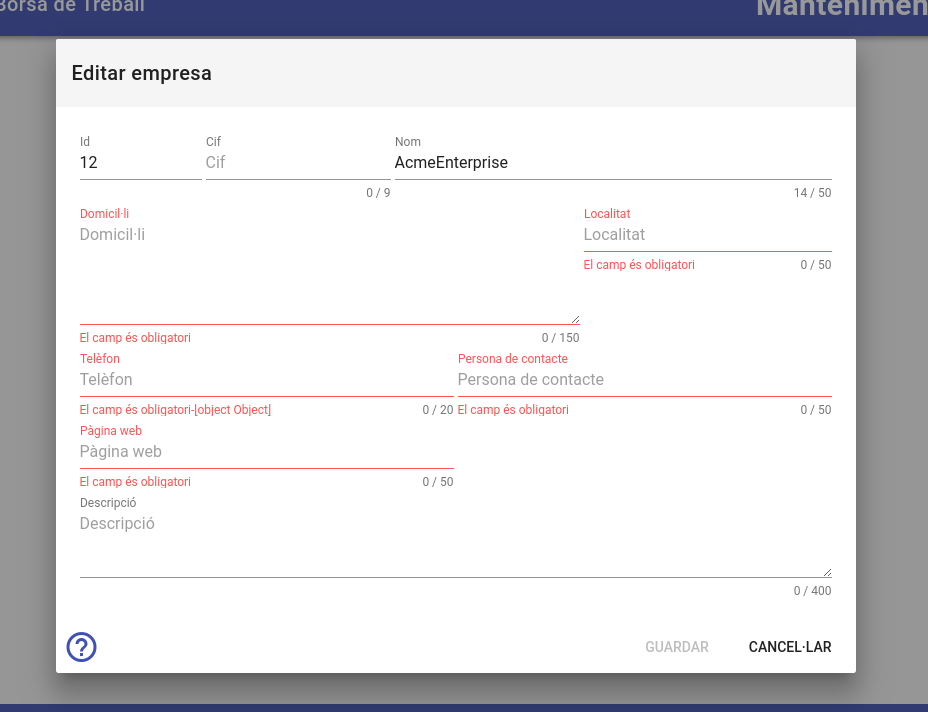
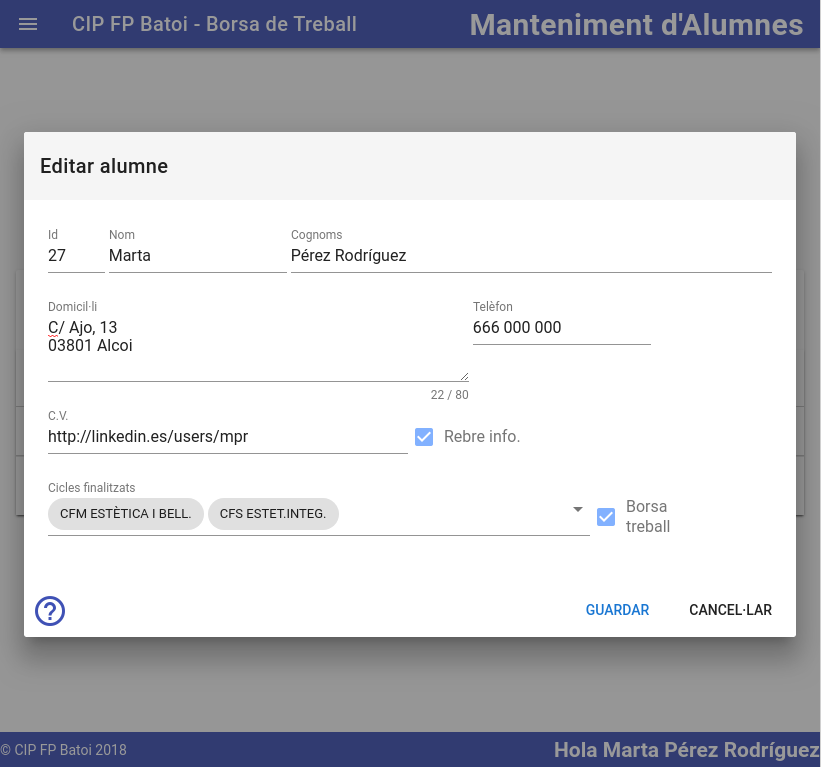

# Registre d'un nou usuari
Des d'ací ens registrem per a poder utilitzar la borsa de treball. Ens demanen:

- **Nom d'usuari**: Un nom per a adreçar-se a nosaltres. No pot estar en blanc
- **E-mail**: El nostre e-mail que será el que haurem d'introduir per a iniciar sessió cada vegada que vulguem accedir a la borsa. Si soc un antic alumne és en aquest e-mail on rebré informació de les ofertes publicades
- **Contrasenya**: La contrasenya que utilitzaré (Junt al e-mail) per a loguejar-me. L'hem de repetir per a evitar equivocacions al escriure-la
- **Tipus d'usuari**: Ací indique si sóc una empresa que vol publicar ofertes de treball o un antic alumne que vol formar parte de la borsa.

Una vegada omplit li donem al botó de **`Continuar`** i ens apareix una nova finestre per a omplir la nostra informació que variarà en funció de si som [una empresa](#registre-duna-nova-empresa) o un [antic alumne](#registre-dun-nou-antic-alumne). 

## Registre d'una nova empresa
Una vegada creat l'usuari es crea també una empresa amb el nom indicat i has d'omplir les seues dades:

- Dades de l'empresa: Cif, Nom (ens posa el que hem indicat en l'usuari però el podem canviar), Domicil·li, Localitat, Telèfon
- Persona de contacte: la persona en qui contactar per a temes relacionats amb la borsa. Cada vegada que introduïm una nova oferta indicarem la persona de contacte, el telèfon i el e-mail per a eixa oferta però per defecte apareixeran els de l'empresa
- Pàgina web: la URL de la pàgina web de l'empresa
- Descripció: per si volem afegir alguna informació adicional sobre a nostra empresa

En la part inferior tenim com semple els botons de:
- Ajuda: ens envia a aquesta pàgina
- Guardar: es guarden les dades introduïdes
- Cancel·lar: es tanca aquesta finestra sense guardar res

## Registre d'un nou antic alumne
Una vegada creat l'usuari es crea també un alumne amb el nom indicat i has d'omplir les seues dades:

- Dades de contacte: Nom (ens posa el que hem indicat en l'usuari però el podem canviar), Cognoms, Domicil·li, Telèfon
- C.V.: ací posem la pàgina web on ingam el nostre curriculum (per exemple http://www.linkedin.es/34ljKsd454). Això és molt important per a que les empreses el puguen consultar
- Rebre info: marquem aquesta casella si volem rebre informació del CIP FP Batoi al nostre e-mail
- Borsa treball: només formarem part de la borsa si marquem aquesta casella
- Cicles finalitzats: és un desplegable on marquem TOTS els cicles que hem estudiat al CIP FP Batoi. Quan una empresa publica una oferta indica el cicle que han de tindre els aspirants i només ens apareixerà la oferta si nosaltres tenim algun dels cicles sol·licitats

En la part inferior tenim com sempre els botons de:
- Ajuda: ens envia a aquesta pàgina
- Guardar: es guarden les dades introduïdes
- Cancel·lar: es tanca aquesta finestra sense guardar res
