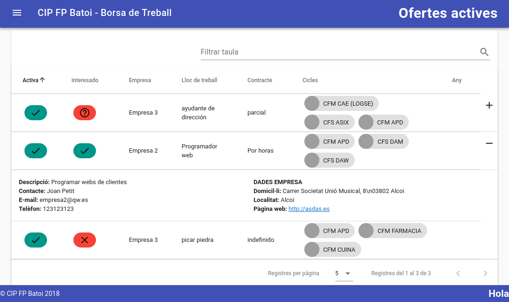
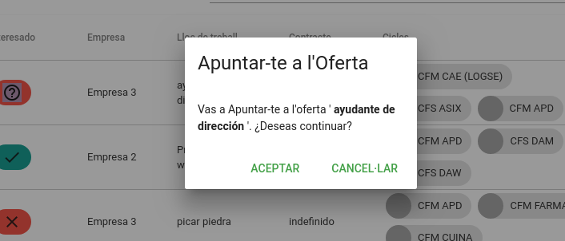
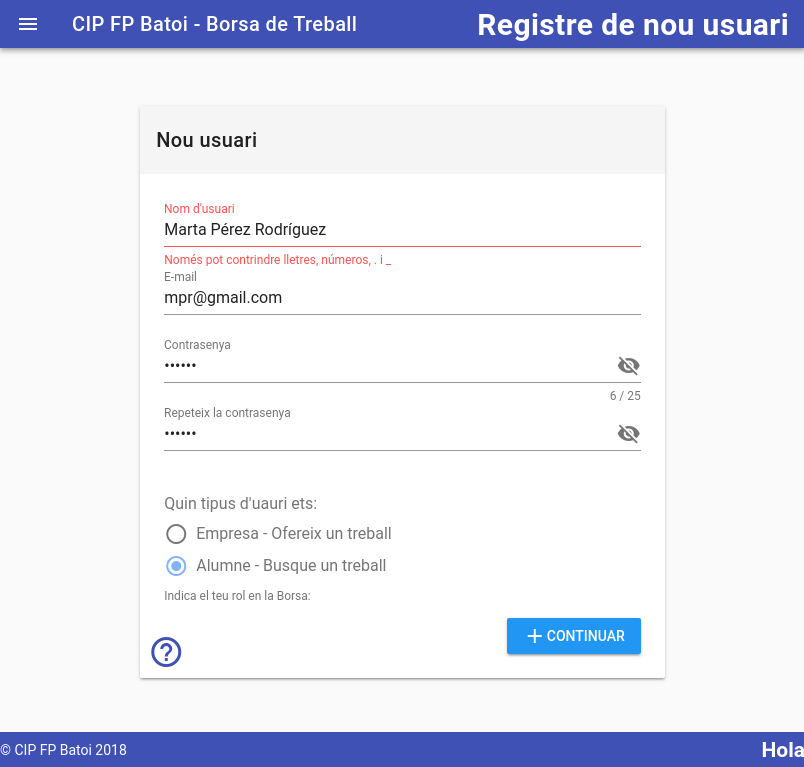

# Manual de l'alumne per a utilitzar la borsa de treball
La utilitat de la borsa per als alumnes i antics alumnes és poder veure les ofertes de treball publicades que demanen algun dels cicles que te i apuntar-se a aquelles ofertes que l'interessen per a que les empreses puguen contactar amb ell.

Per a formar part de la borsa ha d'haver-se [registrat](#registrar-se) per a poder accedir a l'aplicació. En aquet registre indicarà els cicles que estudia o ha estudiat en el Centre.

Cada vegada que es publique una oferta que requereix tindre algun dels cicles que ha finalitzat l'alumne, aquest rebrà un e-mail amb la informació de la oferta i de l'empresa que la publica. Si està interessat en la mateixa només necessita [loguejar-se](#loguejar-se) en l'aplicació i marcar que està [interessat](#apuntar-se-a-una-oferta). 

## Loguejar-se
Només hem d'introduir el nostre email en el qual ens vam registrar i la contrasenya i, si és correcte, se'ns reenviarà automàticament a la pàgina de **Ofertes**.

Si no estem registrats haurem d'anar a la [pàgina de registre](#registrar-se).

## Apuntar-se a una oferta
Al loguejar-nos podem veure les ofertes que demanen algun dels cicles que nosaltres tenim.

De cada oferta podem veure:
- **Activa**: que la oferta està activa i validada. Si no no ens apareixerà
- **Interessat**: si estem interesstats en aquesta oferta (icona verd) o no (aspa roja). Quan rebrem una nova oferta per defecte no estem interessats (interrogant roig) fins que ho indiquem. L'empresa que publica l'oferta només pot veure les nostres dades si estem interessats en la mateixa
- **Lloc de treball**: lloc oferit
- **Contracte**: tipus de contracte
- **Cicles**: cicles que demana l'empresa. Els aspirants han de tindre algun d'aquests cicles
- **Any**: si conté un any significa que l'empresa vol que els candidats hagen finalitzat el cicle amb posterioritat a eixe any
- botó **Més dades**: si el polsem podem veure la resta de dades de l'oferta i les dades de contacte de l'empresa. Si no apareix aquest botó és que l'empresa no vol mostrar les seues dades i són ells qui es posaran en contacte amb els aspirants

Si estem interessats en una oferta només hem de fer doble click sobre la icona de **Interessat** i confirmar que estem insteressats:

En qualsevol moment podem deixar d'estar insteressats tornant a fer doble click.

## Registrar-se

Des d'ací ens registrem per a poder utilitzar la borsa de treball per primera vegada. Pot registrar-se qualsevol alumne o ex-alumne que estudia o ha finalitzat algun cicle en el nostre Centre. Per a registrar-se hem d'introduir:

- **Nom d'usuari**: Un nom per a adreçar-se a nosaltres. 
- **E-mail**: El nostre e-mail que será el que haurem d'introduir per a iniciar sessió cada vegada que vulguem accedir a la borsa. En aquest e-mail és on rebré informació de les ofertes publicades
- **Contrasenya**: La contrasenya que hem d'utilitzar (junt al e-mail) per a loguejar-nos. L'hem de repetir per a evitar equivocacions al escriure-la
- **Tipus d'usuari**: Ací indiquem que sóm un alumne o antic alumne que vol veure les ofertes de treball que es publiquen.

Una vegada omplit li donem al botó de **`Continuar`** i ens apareix una nova finestra per a omplir les nostres dades, que son: 

- Nom, cognoms, Domicil·li i telèfon de contacte
- _Curriculum Vitae_: ací posarem la URL on tenim el nostre curriculum (de Linkedin, Google Drive, ...). És molt important posar el nostre C.V. per a que la empresa el puga veure quan ens inscribim a una oferta seua
- Rebre info: si volem rebre informació del Centre com jornades, etc
- Borsa treball: és obligatori marcar aquesta casella per a formar parte de la borsa i poder rebre ofertes de treball
- Cicles finalitzats: llista desplegable on seleccionem els cicle que tenim (o en els que estem ara matriculats). Es pot consultar la llista de [cicles formatius](../ciclos/lista.md) impartits al Centre.

En la part inferior tenim com sempre els botons de:
- Ajuda: ens envia a la pàgina d'ajuda d'eixa pantalla
- Guardar: es guarden les dades introduïdes
- Cancel·lar: es tanca aquesta finestra sense guardar res
