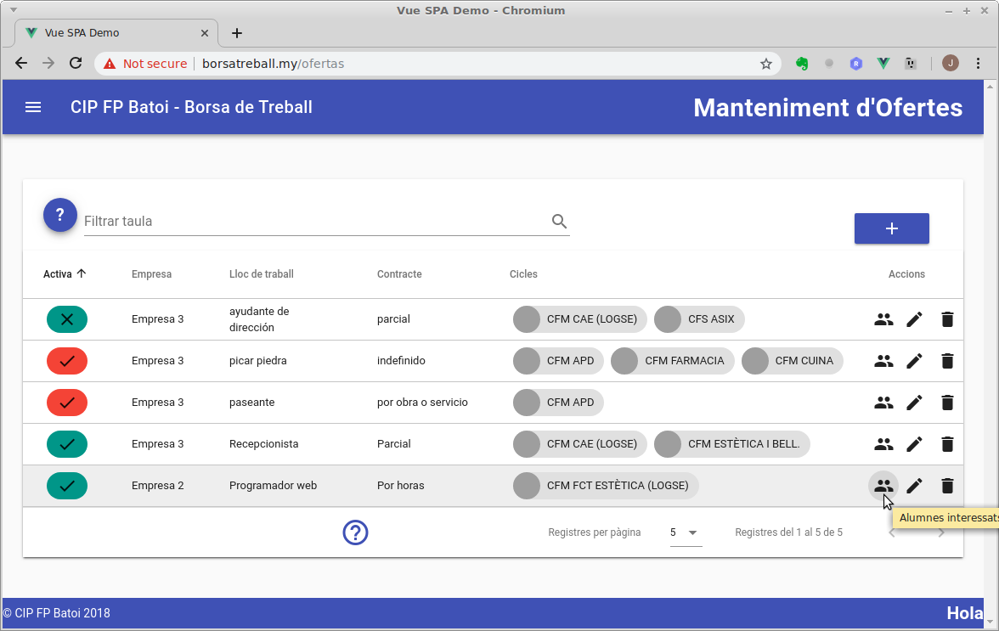
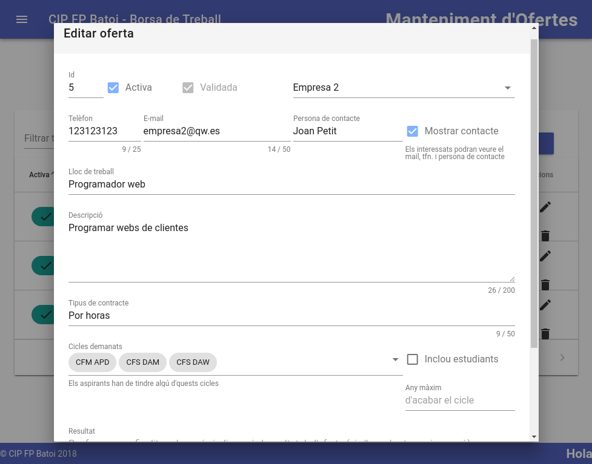
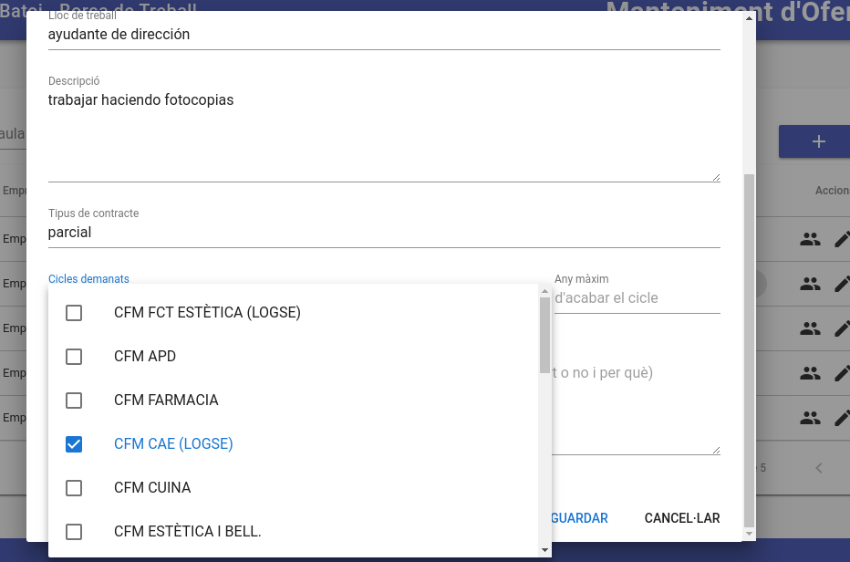
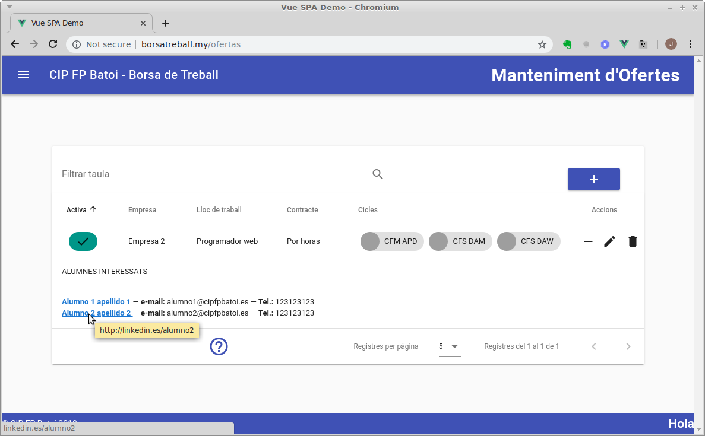
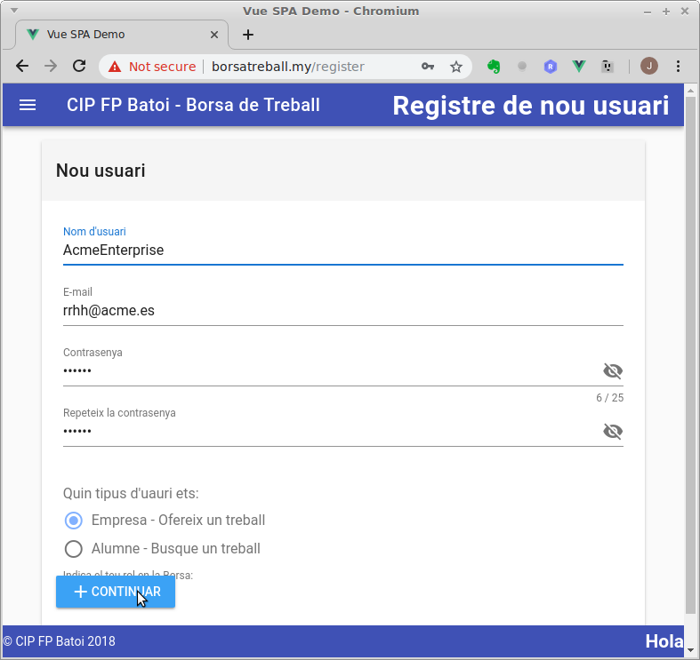

# Manual de la empresa
La utilitat de la borsa per a les empreses es poder afegir ofertes de treball i veure els candidats que millor s'adapten a les seues necessitats.

Per a això només necessita [loguejar-se](#loguejar-se) i [publicar una nova oferta](#publicar-una-nova-oferta). Una vegada validada pel responsable pot [veure els possibles candidats](#veure-els-candidats).

Prèviament ha d'haver-se [registrat](#registrar-se) per a poder accedir a l'aplicació.

## Loguejar-se
Només hem d'introduir el nostre email en el qual ens vam registrar i la contrasenya i, si és correcte, se'ns reenviarà automàticament a la pàgina de [Ofertes](./ofertas).

Si no estem registrats haurem d'anar a la [pàgina de registre](#registrar-se).

## Publicar una nova oferta
Després de loguejar-nos accedim a la pantalla de **_'Ofertes'_** on podem veure les nostres ofertes de treball:

La informació que trobem ací és:
- **Activa**: Indica si l'oferta està actualment **activa** (V) o no (X). Si desactivem una oferta deixarà d'aparèixer-li als candidats. A més el color indica si aquesta oferta ha estat ja **validada** pel responsable de la borsa (color verd) o encara no (color roig). Només els apareixen als candidats les ofertes actives i validades
- **Empresa**: Nom de l'empresa que publica aquesta oferta. Això sempre ho veuen els candidats
- **Lloc de treball**: informació sobre el lloc de treball oferit
- **Tipus de contracte**
- **Cicles demanats**: Cicles que ha tindre un candidat per a poder optar a aquesta oferta. Es pot indicar més d'un cicle i en aquest cas la oferta li apareixerà als candidats que tinguen qualsevol dels cicles demanats. Apareix el codi del cicle i al deixar el ratolí damunt d'ell apareix un missatge amb el nom sencer del cicle. El codi començarà per CFM si es un cicle formatiu de **grau mitjà** o per CFS si és de **grau superior**
- **Accions**: Ací tenim icones per a:
    - **Alumnes interessats**: apareix baix de l'oferta una llista d'alumnes que han vist aquesta oferta i han indicat el seu interés en la mateixa. Podem veure el nom de l'alumne (que conté un enllaç al seu curriculum en cas de que l'haja indicat), el seu e-mail i el seu telèfon.
    - **[Editar](#editar-una-oferta)**: ens permet modificar les dades de l'oferta
    - **Esborrar**: esborra l'oferta. Això vol dir que s'esborraran totes les seues dades. Aquesta acció **NO POT DESFER-SE**.

### Crear una nova oferta
Per a crear una nova oferta pulsem en el botó d'afegir (**+** blau) que trobem sobre la taula a la part dreta. La informació que hem d'omplir és:
- **Activa**: si està activa aquesta oferta. Només les ofertes actives i validades els apareixeran als alumnes. Quan vulguem publicar l'oferta marcarem la casella d'activa.
- **Validada**: aquesta casella només la pot marcar el responsable de la borsa una vegada revisada l'oferta. Només les ofertes actives i validades els apareixeran als alumnes
- **Empresa** que publica l'oferta. Ja apareix seleccionada la meua empresa
- **Telèfon**, **e-mail** i **persona de contacte**: les dades de contacte per a aquesta oferta. Per defecte apareixen les dades de la nostra empresa però les poden canviar. Aquesta informació la veuran els candidats per a contactar amb nosaltres si marquem la casella de _'Mostrar contacte'_
- **Mostrar contacte**: si marquem aquesta casella els candidats podran veure la informació anterior (telèfon, email i persona de contacte) junt a l'oferta. Si no, no veuran més que el nom de la nostra empresa i serem nosaltres els encarregats de posar-nos en contacte amb ells. Per defecte està marcada
- **Lloc de treball**: informació del lloc de trebal oferit
- **Descripció**: una descripció mes llarga del treball oferit
- **Tipus de contracte**: informació sobre el contracte oferit (temps parcial, indefinit, ...)
- **Cicles demanats**: llista desplegable on seleccionem el cicle que ha de tindre un alumne per a poder veure aquesta oferta. Si seleccionem més d'un cicle la oferta els apareixerà a tots els alumnes que tinguen algun dels cicles seleccionats. Pots consultar la llista de [cicles formatius](../ciclos/lista.md) impartits al Centre.
- **Inclou estudiants**: si marquem aquesta casella indiquem que també pode optar a aquesta oferta els alumnes que ara estan estudiant el cicle (i encara no l'han acabat)
- **Any màxim d'acabar el cicle**: aquest camp és opcional. Si posem un any l'oferta només es mostrarà als candidats que hagen acabat els seus estudis amb posterioritat a l'any indicat. Si ho deixem en blanc se li mostrarà a tots els candidats que tinguen el cicle.

Quan afegim una nova oferta el responsable dels cicles sol·licitats rebrà un missatge per a **validar-la**. Una vegada validada una oferta activa tots els candidats de la borsa que complisquen els criteris indicats rebran un email amb aquesta oferta. Els que estiguen interessats ho indicaran i a partir d'eixe moment ens apareixeran en la taula ofertes al polsar sobre el botó d'**alumnes interessats**.

### Editar una oferta
Des d'ací podem modificar les dades de l'oferta:

Una vegada modificada, per a que es guarden els canvis hem de prèmer el botó de **GUARDAR**. Si volem descartar els canvis polsarem el botó de **CANCEL·LAR**. Per a obtindre ajuda pulsarem sobre la icona de l'interrogant.

Si volem canviar els cicles polsem sobre la línia de cicles demanats i es desplegarà una llista amb tots els cicles disponibles. Marquem la casella dels que vulgam i punxem fora de la llista amb el ratolí per a veure els cicles seleccionats:

## Veure els candidats
Des de la taula d'**Ofertes** podem veure els candidats que s'han interessat per la nostra oferta pulsant el primer botó d'accions de la oferta:

De cada candidat podem veure el seu nom (que conté un enllaç al se _Curriculum Vitae_ si ho te), e-mail i teléfon per si volem posar-nos en contacte amb ells. Si en la oferta vam desmarcar la casella de _Mostrar contacte_ els candidats no podran posar-se en contacte amb nosaltres i som nosaltres els que haurem de contactar en ells.

## Registrar-se

Des d'ací ens registrem per a poder utilitzar la borsa de treball per primera vegada. Ens demanen:

- **Nom d'usuari**: Un nom per a adreçar-se a nosaltres. 
- **E-mail**: El nostre e-mail que será el que haurem d'introduir per a iniciar sessió cada vegada que vulguem accedir a la borsa. Si soc un antic alumne és en aquest e-mail on rebré informació de les ofertes publicades
- **Contrasenya**: La contrasenya que hem d'utilitzar (junt al e-mail) per a loguejar-nos. L'hem de repetir per a evitar equivocacions al escriure-la
- **Tipus d'usuari**: Ací indiquem que sóm una empresa que vol publicar ofertes de treball.

Una vegada omplit li donem al botó de **`Continuar`** i ens apareix una nova finestre per a omplir les dades de la nostra empresa, que son: 

- Dades de l'empresa: Cif, Nom (ens posa el que hem indicat en l'usuari però el podem canviar), Domicil·li, Localitat, Telèfon
- Persona de contacte: la persona en qui contactar per a temes relacionats amb la borsa. Cada vegada que introduïm una nova oferta indicarem la persona de contacte, el telèfon i el e-mail per a eixa oferta però per defecte apareixeran els de l'empresa
- Pàgina web: la URL de la pàgina web de l'empresa
- Descripció: per si volem afegir alguna informació adicional sobre a nostra empresa

En la part inferior tenim com sempre els botons de:
- Ajuda: ens envia a aquesta pàgina
- Guardar: es guarden les dades introduïdes
- Cancel·lar: es tanca aquesta finestra sense guardar res

