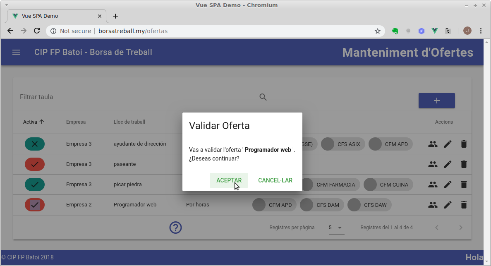
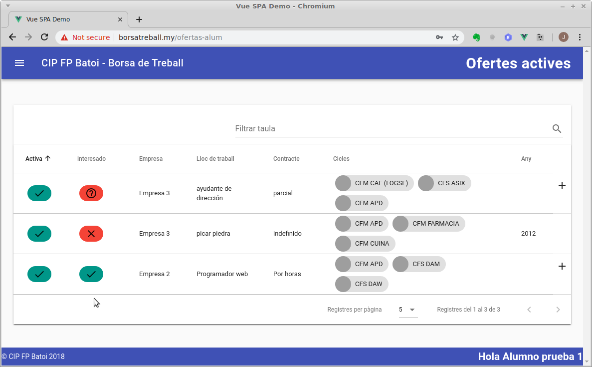
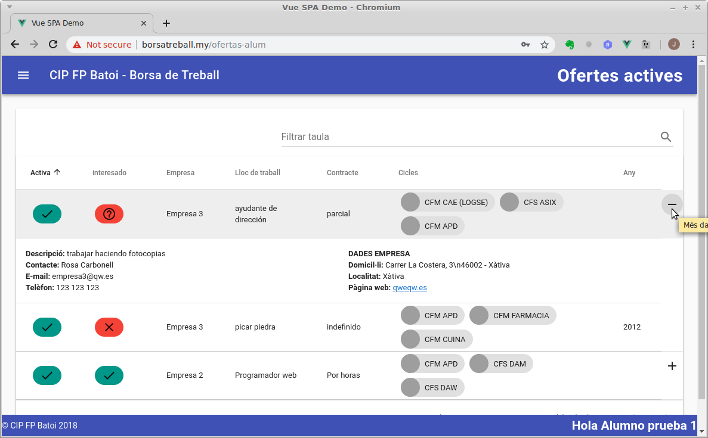
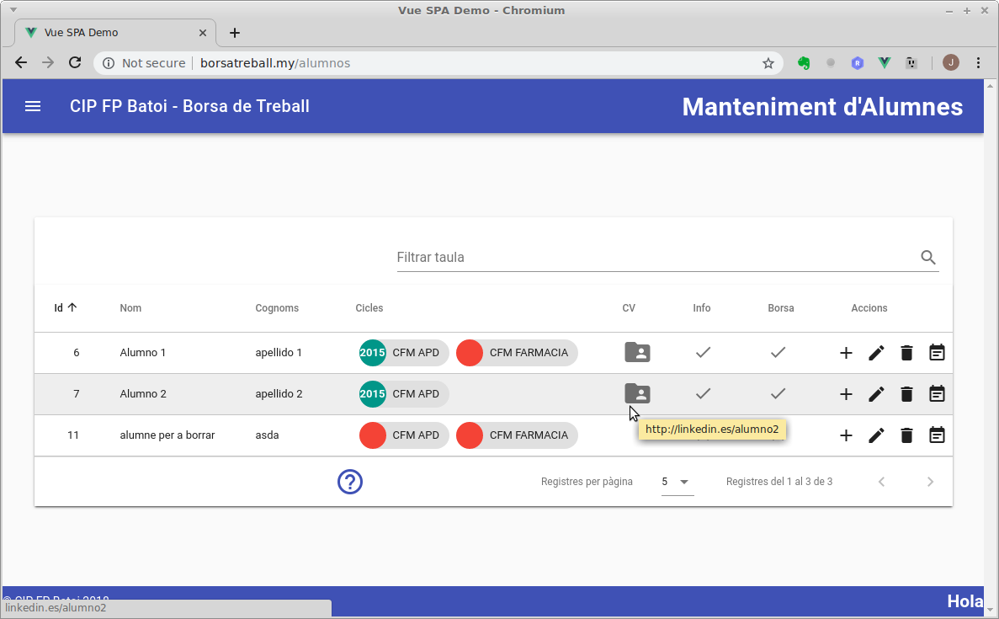
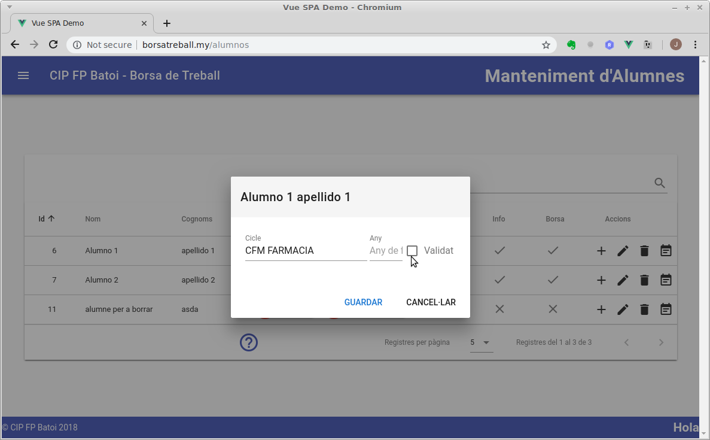
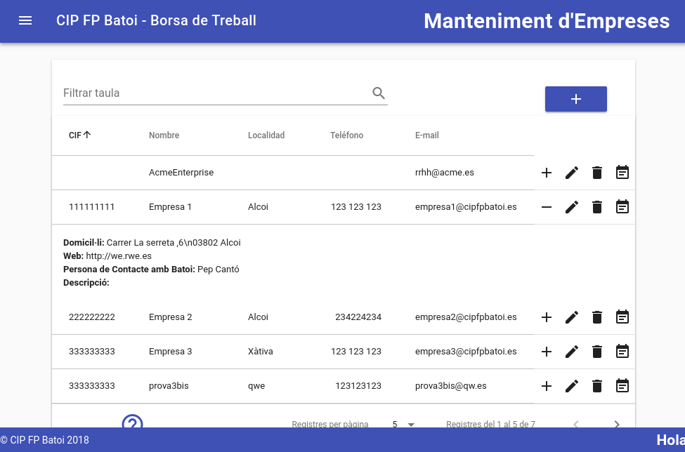
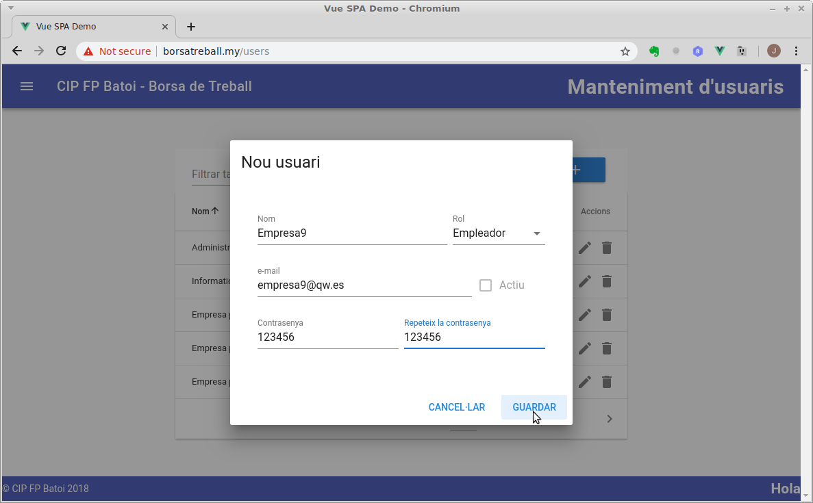
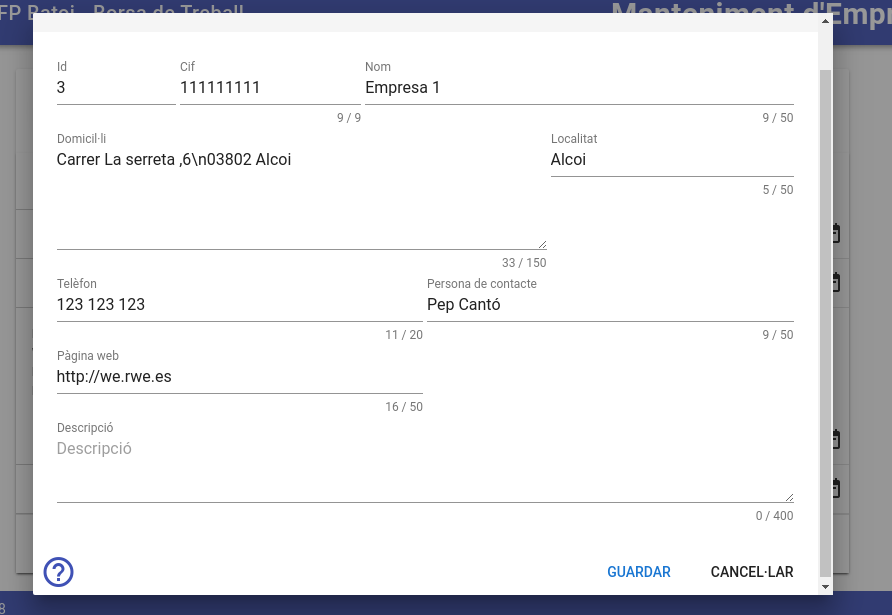

# Manual dels Responsables de la borsa de treball
Els responsables de la borsa tenen 2 funcions principals:
- [Validar les ofertes](#validar-oferta) de treball publicades per les empreses que demanen un cicle del qual és responsable
- [Validar els cicles dels alumnes](#validar-cicles-dun-alumne) dels qual és reaponsable

A més posiblement haurà de [registrar empreses](#registrar-una-nova-empresa) i [crear les seues ofertes](#crear-una-nova-oferta) per a aquelles empreses que volen ofertar un treball però no volen utilitzar la nostra Borsa.

Anem a veure còm fer aquestes tasques.

## Validar oferta
Quan una empresa crea una nova oferta s'envia un e-mail al responsable del cicle o cicles sol·licitats en aquesta oferta per a que la validen. En molts casos coneixerem a aquesta empresa de treballar amb ella en la FCT (si no podria ser un bon moment per a contactar amb ells i oferir-los la possibilitat de tindre alumnes en pràcticas de FCT o FP Dual). 

Al entrar a l'aplicació i anar a **_'Ofertes'_** veurem totes les ofertes que hi ha actualment dels cicles dels quals som responsables:

El primer camp (**_'Activa'_**) indica:
- Validada: si la oferta ja està validada (color **verd**) o encara no (color **roig**)
- Activa: si la oferta està activa (V) o no (X). L'empresa pot desactivar una oferta en qualsevol moment i no els apareixerà als alumnes.

Per a validar una oferta fem doble click sobre la seua icona d'activa/validada. Si no està validada es validarà i si ja ho està es desvalidarà:

Una vegada validada cada alumne que tinga un dels cicles sol·licitats rebrà un e-mail amb la informació de l'oferta on pot indicar el seu interes en la mateixa. També li apareixerà en l'aplicació i pot indicar que està interessat fent doble click en la icona de **_'Interessat'_**. El significat dels símbols del camp '_Interessat_' és:
- **V** (verd): l'alumne està interessat en aquesta oferta
- **X** (roig): l'alumne NO està interessat en aquesta oferta
- **?** (roig): l'alumne no ha indicat si està o no interessat

Si la empresa ha marcat en l'oferta el camp de **_'Mostrar contacte'_**, els alumnes, junt a la informació de l'oferta tindran un botó (+) que els mostrarà les dades de contacte de la empresa per a aquesta oferta:

Quan l'empresa entra a l'aplicació  a veure les seues ofertes, la primera icona que l'apareixerà serà la de veure els alumnes interessats:

## Validar cicles d'un alumne
Els alumnes al registrar-se indiquen els cicles que han finalitzat en el nostre Centre o estan estudiant ara. Nosaltres som els responsables de validar que realment han fet els cicles indicats (o estan ara matriculats) i en quin any l'han acabat.

Al entrar a l'aplicació i anar al menú **_'Alumnes'_** ens apareixen tots els alumnes amb cicles dels quals som responsables:

Cada cicle te un cercle en que es mostra l'any en que l'alumne el va finalitzar, i serà de color **verd** si està **validat** i **roig** si no ho està. Si deixem el ratolí sobre el codi del cicle ens apareix el seu nom sencer:

Per a validar un cicle hem de fer doble click sobre el mateix:

Hem d'indicar l'any de finalització i marcar la casella de **_'Validar'_**. Podem des-validar un cicle validat de la mateixa manera. En el cas que l'alumne encara estiga matriculat en el cicle perquè no l'ha finalitzat **deixarem en blanc** l'any de finalització al validar-lo (per tant és molt important posar aquest any en els alumnes que han finalitzat el cicle perquè si no es considera que encara estan matriculats en el mateix).

Normalment haurem de validar els alumnes de la última promoció i per tant sabem qui són i l'any en que han acabat (l'any actual). Però si es registra algun alumne d'anys anteriors (això pasarà sobre tot ara al principi de funcionar la borsa) i no el coneixem o no sabem quin any va acabar contactarem en **Caporalia** per a que ens ho confirmen. No hem de validar un alumne del que no sabem amb seguretat que ha fet els cicles que indica. 

També és posible que vulgam que es puguen registrar els alumnes que encara estan estudiant (especialmen els de segon curs). En aquest cas deixarem en blanc l'any de finalització al validar-los i quan finalitzen els posarem aquest any. Si algun alumne es dona de baixa o no torna a matricular-se el següent any sense haber finalitzat el cicle li ho haurem de des-validar.

## Registrar una nova empresa
Si rebrem una oferta d'una empresa que no vol donar-se d'alta en la nostra borsa ho haurem de fer nosaltres per ella. Abans de crear una nova empresa s'ha de comprovar que no està ja creada (potser ha publicat alguna oferta d'altre cicle anteriorment). Desde el menú **_'Empreses_'** podem veure totes les que hi ha i filtrar-les per nom, CIF, localitat, ...

Si no està l'haurem de crear. Al crear-la es crearà un nou usuari (per a que es puga loguejar per a veure els nteressats en l'oferta) i una nova empresa. Ho farem amb el botó de **_'Nova empresa'_** (botó blau amb **+** sobre la taula, en la part dreta).

El primer pas es crear l'usuari per a la qual cosa hem d'introduir:
- Nom: el nom de l'empresa
- Rol: serà _Empleador_
- E-mail: el e-mail de l'empresa per a contactar amb ells. És obligatori
- Contrasenya: li posem una contrasenya, que pot ser el seu cif, 123456, o el que vulgam. L'empresa la podrà canviar quan ho dessitge des del menú de _'Perfil'_. 

Amb això hem creat l'usuari i l'empresa però les seues dades estan buides. Ara les hem de completar:
- Cif: és obligatori posar-ho per a asesgurar-nos de no tindre 2 vegades la mateixa empresa
- Domicil·li, Localitat, Telèfon, Persona de contacte, Pàgina web
- Descripció: és un camp opcional per si es vol posar altra informació sobre l'empresa

L'empresa rebrà un e-mail (en el e-mail indicat al crear l'usuari) informant-li de que se li ha donat d'alta en la borsa. Quan confirme aquest e-mail ja podrà accedir a l'aplicació amb el e-mail i contrasenya indicades per nosaltres.

## Crear una nova oferta
El primer que farem és anar al menú **_'Empreses'_** per a assegurar-nos de que l'empresa ja existeix (i si no donar-la d'alta com hem vist abans). Quan la trobem clickem en el botó de **_'Veure ofertes'_** (l'últim) i ens apareixen les ofertes d'eixa empresa.

Ara estem en la pantalla de **_'Ofertes'_** i per a crear una nova clickem en el botó de **_'Nova oferta'_** (botó blau amb **+** sobre la taula, a la part dreta). Els camps que hem d'omplir són:
- **Activa**: si volem que l'oferta siga visible per als alumnes que només poden veure les ofertes actives i validades. Per defecte sí
- **Empresa**: desplegable on seleccionem l'empresa de l'oferta. Si ho hem fet com s'indica ja ens apareix l'empresa seleccionada. Si no l'hem de seleccionar nosaltres
- **Telèfon**, **email** i **persona de contacte**: per defecte es posen els de l'empresa seleccionada (i si camviem l'empresa es canviaran). Podem posar els que vulgam per a aquesta oferta en concret
- **Mostrar contacte**: si marquem aquesta casella els alumnes podran veure la informació anterior (telèfon, email i persona de contacte) junt a l'oferta. Si no, no veuran més que el nom de l'empresa i serà l'empresa l'encarregada de posar-se en contacte amb ells. Per defecte està marcada
- **Lloc de treball**: el lloc de treball oferit
- **Descripció**: una descripció més detallada del mateix
- **Tipus de contracte**: informació sobre el contracte oferit (temps parcial, indefinit, ...)
- **Cicles demanats**: llista desplegable on seleccionem el cicle que ha de tindre un alumne per a poder veure aquesta oferta. Si seleccionem més d'un cicle la oferta els apareixerà a tots els alumnes que tinguen algun dels cicles seleccionats. Pots consultar la llista de [cicles formatius](../ciclos/lista.md) impartits al Centre.
- **Inclou estudiants**: si marquem aquesta casella l'oferta serà també visible per als alumnes registrats que encara no hagen finalitzat el cicle (que estiguen estudiant-lo ara)
- **Any màxim d'acabar**: aquest camp és opcional. Si posem un any l'oferta només es mostrarà als alumnes que hagen acabat els seus estudis amb posterioritat a l'any indicat. Si ho deixem en blanc se li mostrarà a tots els alumnes que tinguen el cicle.

Ara hem de validar l'oferta. Per a això fem doble click sobre la icona de **_'Activa/Validada'_** que ara estarà en roig (perquè està sense validar):

Una vegada validada una oferta activa tots els alumnes de la borsa que complisquen els criteris indicats rebran un email amb aquesta oferta. Els que estiguen interessats ho indicaran i a partir d'eixe moment ens apareixeran en la taula **_'Ofertes'_** al polsar sobre el botó d'**alumnes interessats**.

